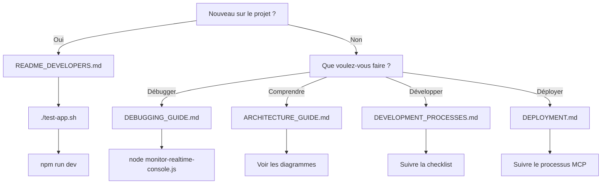

# 📚 INDEX DE LA DOCUMENTATION - INVENTORY MANAGER

## 🎯 GUIDES PRINCIPAUX

Bienvenue dans la documentation complète de l'Inventory Manager. Cette page vous guide vers les bons documents selon vos besoins.

---

## 🚀 JE VEUX DÉMARRER RAPIDEMENT

**👉 Commencez par :** [README_DEVELOPERS.md](README_DEVELOPERS.md)

**Ensuite :**
1. Installez les dépendances : `npm install`
2. Lancez les tests : `./test-app.sh`
3. Démarrez l'app : `npm run dev`

**Temps estimé :** 5 minutes

---

## 🔧 JE VEUX DÉBUGGER UN PROBLÈME

**👉 Consultez :** [docs/DEBUGGING_GUIDE.md](docs/DEBUGGING_GUIDE.md)

**Outils disponibles :**
- `node monitor-realtime-console.js` - Monitoring en temps réel
- `./test-app.sh` - Tests automatiques
- `tail -f logs/console-errors.log` - Logs d'erreurs

**Problèmes déjà résolus :** [PROBLEMES_CORRIGES.md](PROBLEMES_CORRIGES.md)

---

## 🏗️ JE VEUX COMPRENDRE L'ARCHITECTURE

**👉 Consultez :** [docs/ARCHITECTURE_GUIDE.md](docs/ARCHITECTURE_GUIDE.md)

**Contenu :**
- Vue d'ensemble de l'architecture
- Structure du projet détaillée
- Flux de données avec diagrammes
- Composants clés
- Services et API
- Base de données complète
- Conventions et standards

---

## 📖 JE VEUX SUIVRE LES PROCESSUS DE DÉVELOPPEMENT

**👉 Consultez :** [docs/DEVELOPMENT_PROCESSES.md](docs/DEVELOPMENT_PROCESSES.md)

**Processus obligatoires :**
- Workflow de développement
- Versioning sémantique
- Tests obligatoires
- Validation utilisateur
- Déploiement via MCP

---

## 🎉 JE VEUX VOIR CE QUI A ÉTÉ FAIT RÉCEMMENT

**👉 Consultez :**
- [SYNTHESE_RESTRUCTURATION.md](SYNTHESE_RESTRUCTURATION.md) - Vue d'ensemble
- [PROBLEMES_CORRIGES.md](PROBLEMES_CORRIGES.md) - Bugs résolus
- [RESTRUCTURATION_2025.md](RESTRUCTURATION_2025.md) - Détails restructuration
- [CHANGELOG.md](CHANGELOG.md) - Historique des versions

---

## 📋 TOUS LES DOCUMENTS DISPONIBLES

### 📁 Racine du projet

| Document | Taille | Description |
|----------|--------|-------------|
| **README.md** | 9.2 KB | Installation et utilisation générale |
| **README_DEVELOPERS.md** | 14 KB | Guide complet des développeurs |
| **CHANGELOG.md** | 40 KB | Historique des versions |
| **SYNTHESE_RESTRUCTURATION.md** | 17 KB | Vue d'ensemble restructuration |
| **PROBLEMES_CORRIGES.md** | 15 KB | Liste des bugs corrigés |
| **RESTRUCTURATION_2025.md** | 12 KB | Détails de la restructuration |
| **MIGRATION_LOG.md** | 498 B | Log des migrations BDD |
| **VERCEL_SETUP.md** | 2 KB | Configuration Vercel |
| **CURSOR_RULES_SETUP.md** | 12 KB | Configuration des règles Cursor ⭐ NEW |
| **DOCUMENTATION_INDEX.md** | Ce fichier | Index de navigation |

## 🤖 Règles Cursor (Nouveau!)

| Document | Taille | Description |
|----------|--------|-------------|
| **.cursorrules** | 10 KB | Règles principales Cursor (auto-lu) ⭐ |
| **.cursor/agent.md** | 30 KB | Guide complet pour l'agent IA ⭐ |
| **.cursor/conventions.md** | 25 KB | Conventions de code détaillées |
| **.cursor/workflow.md** | 20 KB | Workflow de développement complet |
| **.cursor/README.md** | 12 KB | Navigation des règles Cursor |

**Total règles Cursor : 5 fichiers, ~97 KB** ✨ NEW

### 📁 docs/

| Document | Description |
|----------|-------------|
| **APPLICATION_DOCUMENTATION.md** | Documentation complète de l'application |
| **ARCHITECTURE_GUIDE.md** | Guide d'architecture (97 KB, 1,183 lignes) |
| **DEBUGGING_GUIDE.md** | Guide de debugging (159 KB, 1,022 lignes) |
| **DEVELOPMENT_PROCESSES.md** | Processus de développement obligatoires |
| **DEPLOYMENT.md** | Guide de déploiement |
| **MONITORING.md** | Monitoring et logs |
| **PHASE2_AI_INTEGRATION.md** | Plan Phase 2 (IA) |
| **PRODUCT_FIELD_TEMPLATE.md** | Template champs produits |
| **QUICK_START.md** | Démarrage rapide |
| **SIMPLIFIED_DEVELOPMENT.md** | Développement simplifié |
| **database-setup.sql** | Script création BDD |
| **database-migration-pieces.sql** | Migration pièces |
| **database-migration-stock.sql** | Migration stock |

**Total : 12 fichiers dans docs/**

### 🛠️ Outils et scripts

| Fichier | Taille | Description |
|---------|--------|-------------|
| **monitor-realtime-console.js** | 12 KB | Monitoring temps réel avec Puppeteer |
| **test-app.sh** | 9.4 KB | Suite de tests automatiques |
| **debug.config.js** | 9.9 KB | Configuration debugging centralisée |

---

## 🎯 NAVIGATION PAR BESOIN

### Besoin : "Je suis un nouvel développeur"

1. 📖 [README_DEVELOPERS.md](README_DEVELOPERS.md) - Démarrage
2. 🏗️ [docs/ARCHITECTURE_GUIDE.md](docs/ARCHITECTURE_GUIDE.md) - Comprendre l'app
3. 📝 [docs/DEVELOPMENT_PROCESSES.md](docs/DEVELOPMENT_PROCESSES.md) - Processus
4. 🔧 [docs/DEBUGGING_GUIDE.md](docs/DEBUGGING_GUIDE.md) - Debugging

### Besoin : "Je suis un agent IA"

1. 🤖 [.cursor/agent.md](.cursor/agent.md) - Guide complet agent IA ⭐ NEW
2. 🏗️ [docs/ARCHITECTURE_GUIDE.md](docs/ARCHITECTURE_GUIDE.md) - Contexte complet
3. 📖 [docs/APPLICATION_DOCUMENTATION.md](docs/APPLICATION_DOCUMENTATION.md) - Fonctionnalités
4. 🔧 [docs/DEBUGGING_GUIDE.md](docs/DEBUGGING_GUIDE.md) - Outils de debugging
5. 🚨 [PROBLEMES_CORRIGES.md](PROBLEMES_CORRIGES.md) - Problèmes connus

### Besoin : "J'ai un bug"

1. 🔧 [docs/DEBUGGING_GUIDE.md](docs/DEBUGGING_GUIDE.md) - Processus de debugging
2. 🚨 [PROBLEMES_CORRIGES.md](PROBLEMES_CORRIGES.md) - Solutions existantes
3. 📖 [README_DEVELOPERS.md](README_DEVELOPERS.md) - Outils disponibles
4. 🛠️ **Lancez :** `node monitor-realtime-console.js`

### Besoin : "Je veux ajouter une feature"

1. 🏗️ [docs/ARCHITECTURE_GUIDE.md](docs/ARCHITECTURE_GUIDE.md) - Structure existante
2. 📝 [docs/DEVELOPMENT_PROCESSES.md](docs/DEVELOPMENT_PROCESSES.md) - Workflow
3. 📖 [README_DEVELOPERS.md](README_DEVELOPERS.md) - Scripts et conventions
4. 🧪 **Lancez :** `./test-app.sh` (avant et après)

### Besoin : "Je veux déployer"

1. 📝 [docs/DEVELOPMENT_PROCESSES.md](docs/DEVELOPMENT_PROCESSES.md) - Processus de déploiement
2. 🚀 [docs/DEPLOYMENT.md](docs/DEPLOYMENT.md) - Guide de déploiement
3. 📊 [docs/MONITORING.md](docs/MONITORING.md) - Surveillance post-déploiement
4. 🔖 **Mettez à jour :** Version avec `npm run version:patch`

---

## 🔍 RECHERCHE RAPIDE

### Par sujet

| Sujet | Document principal |
|-------|-------------------|
| **Architecture** | [docs/ARCHITECTURE_GUIDE.md](docs/ARCHITECTURE_GUIDE.md) |
| **Debugging** | [docs/DEBUGGING_GUIDE.md](docs/DEBUGGING_GUIDE.md) |
| **Développement** | [README_DEVELOPERS.md](README_DEVELOPERS.md) |
| **Processus** | [docs/DEVELOPMENT_PROCESSES.md](docs/DEVELOPMENT_PROCESSES.md) |
| **Déploiement** | [docs/DEPLOYMENT.md](docs/DEPLOYMENT.md) |
| **Base de données** | [docs/ARCHITECTURE_GUIDE.md](docs/ARCHITECTURE_GUIDE.md#base-de-données) |
| **Bugs connus** | [PROBLEMES_CORRIGES.md](PROBLEMES_CORRIGES.md) |
| **Historique** | [CHANGELOG.md](CHANGELOG.md) |

### Par tâche

| Tâche | Document | Commande |
|-------|----------|----------|
| **Installer l'app** | [README.md](README.md) | `npm install` |
| **Tester l'app** | [README_DEVELOPERS.md](README_DEVELOPERS.md#tests) | `./test-app.sh` |
| **Débugger** | [docs/DEBUGGING_GUIDE.md](docs/DEBUGGING_GUIDE.md) | `node monitor-realtime-console.js` |
| **Comprendre un composant** | [docs/ARCHITECTURE_GUIDE.md](docs/ARCHITECTURE_GUIDE.md#composants-clés) | - |
| **Voir les processus** | [docs/DEVELOPMENT_PROCESSES.md](docs/DEVELOPMENT_PROCESSES.md) | - |
| **Vérifier la version** | [CHANGELOG.md](CHANGELOG.md) | `npm run version:show` |

---

## 📊 STATISTIQUES DE LA DOCUMENTATION

### Par type

| Type | Nombre | Taille totale | Lignes totales |
|------|--------|---------------|----------------|
| **Guides techniques** | 3 | 270 KB | ~2,789 lignes |
| **Documentation app** | 9 | 60 KB | ~1,500 lignes |
| **Rapports** | 3 | 44 KB | ~900 lignes |
| **Scripts SQL** | 3 | 15 KB | ~300 lignes |
| **Outils** | 3 | 31 KB | ~1,404 lignes |

**Total : 21 fichiers, ~420 KB, ~6,893 lignes**

### Par audience

| Audience | Documents recommandés | Total |
|----------|----------------------|-------|
| **Utilisateurs** | 2 documents | ~50 KB |
| **Développeurs** | 8 documents | ~200 KB |
| **Agents IA** | 6 documents | ~300 KB |
| **Support** | 3 documents | ~60 KB |

---

## 🛠️ OUTILS INTÉGRÉS

### Scripts npm (30+ disponibles)

```bash
# Développement
npm run dev              # Serveur de développement
npm run dev:monitor      # Serveur avec monitoring
npm run dev:clean        # Redémarrage propre

# Tests et vérifications
npm run type-check       # Vérification TypeScript
npm run lint            # Vérification linting
npm run build:check     # Vérification build
./test-app.sh           # Tests automatiques complets

# Logs
npm run logs            # Afficher les logs
npm run logs:error      # Erreurs seulement

# Versioning
npm run version:patch   # V0.0.X
npm run version:minor   # V0.X.0
npm run version:major   # VX.0.0
npm run version:show    # Afficher version

# Monitoring custom
node monitor-realtime-console.js    # Monitoring temps réel
```

### Scripts bash

```bash
# Tests
./test-app.sh                    # Suite de tests complète
./quick-check.sh                 # Vérification rapide (si existe)

# Monitoring
./monitor-logs.sh                # Monitoring logs (si existe)
./monitor-js-errors.sh           # Monitoring erreurs JS (si existe)
```

---

## 📞 BESOIN D'AIDE ?

### Problème technique

1. **Consulter** [docs/DEBUGGING_GUIDE.md](docs/DEBUGGING_GUIDE.md)
2. **Vérifier** [PROBLEMES_CORRIGES.md](PROBLEMES_CORRIGES.md)
3. **Lancer** `./test-app.sh`
4. **Monitorer** `node monitor-realtime-console.js`

### Question sur l'architecture

1. **Consulter** [docs/ARCHITECTURE_GUIDE.md](docs/ARCHITECTURE_GUIDE.md)
2. **Voir** les diagrammes de flux de données
3. **Examiner** les composants clés

### Question sur les processus

1. **Consulter** [docs/DEVELOPMENT_PROCESSES.md](docs/DEVELOPMENT_PROCESSES.md)
2. **Suivre** la checklist complète
3. **Respecter** les règles de versioning

---

## ⭐ DOCUMENTS LES PLUS IMPORTANTS

### Top 5 pour les développeurs

1. 🥇 **[README_DEVELOPERS.md](README_DEVELOPERS.md)** - Guide de démarrage
2. 🥈 **[docs/DEBUGGING_GUIDE.md](docs/DEBUGGING_GUIDE.md)** - Debugging quotidien
3. 🥉 **[docs/ARCHITECTURE_GUIDE.md](docs/ARCHITECTURE_GUIDE.md)** - Comprendre l'app
4. 🏅 **[docs/DEVELOPMENT_PROCESSES.md](docs/DEVELOPMENT_PROCESSES.md)** - Processus
5. 🎖️ **[PROBLEMES_CORRIGES.md](PROBLEMES_CORRIGES.md)** - Bugs connus

### Top 5 pour les agents IA

1. 🤖 **[.cursor/agent.md](.cursor/agent.md)** - Guide complet agent IA ⭐ NEW
2. 🤖 **[.cursor/workflow.md](.cursor/workflow.md)** - Workflow de développement ⭐ NEW
3. 🤖 **[docs/ARCHITECTURE_GUIDE.md](docs/ARCHITECTURE_GUIDE.md)** - Contexte complet
4. 🤖 **[docs/DEBUGGING_GUIDE.md](docs/DEBUGGING_GUIDE.md)** - Outils de debugging
5. 🤖 **[SYNTHESE_RESTRUCTURATION.md](SYNTHESE_RESTRUCTURATION.md)** - État actuel

---

## 📁 STRUCTURE DE LA DOCUMENTATION

```
inventory-app/
├── 📄 README.md                          # Installation et utilisation
├── 📄 README_DEVELOPERS.md               # Guide des développeurs ⭐
├── 📄 DOCUMENTATION_INDEX.md             # Ce fichier
├── 📄 CHANGELOG.md                       # Historique des versions
├── 📄 SYNTHESE_RESTRUCTURATION.md        # Vue d'ensemble
├── 📄 PROBLEMES_CORRIGES.md              # Bugs résolus ⭐
├── 📄 RESTRUCTURATION_2025.md            # Résumé restructuration
├── 📄 MIGRATION_LOG.md                   # Migrations BDD
├── 📄 VERCEL_SETUP.md                    # Configuration Vercel
├── 📄 CURSOR_RULES_SETUP.md              # Configuration Cursor ⭐ NEW
│
├── 📄 .cursorrules                       # Règles Cursor principales ⭐ NEW
│
├── 📁 .cursor/                           # Règles Cursor détaillées ⭐ NEW
│   ├── 📄 agent.md                       # Guide complet agent IA (30 KB)
│   ├── 📄 conventions.md                 # Conventions de code (25 KB)
│   ├── 📄 workflow.md                    # Workflow développement (20 KB)
│   └── 📄 README.md                      # Navigation règles Cursor
│
├── 📁 docs/                              # Documentation détaillée
│   ├── 📄 DEBUGGING_GUIDE.md             # Guide debugging ⭐ (159 KB)
│   ├── 📄 ARCHITECTURE_GUIDE.md          # Guide architecture ⭐ (97 KB)
│   ├── 📄 APPLICATION_DOCUMENTATION.md   # Doc application complète
│   ├── 📄 DEVELOPMENT_PROCESSES.md       # Processus développement ⭐
│   ├── 📄 DEPLOYMENT.md                  # Guide déploiement
│   ├── 📄 MONITORING.md                  # Monitoring et logs
│   ├── 📄 PHASE2_AI_INTEGRATION.md       # Plan Phase 2
│   ├── 📄 PRODUCT_FIELD_TEMPLATE.md      # Template champs produits
│   ├── 📄 QUICK_START.md                 # Démarrage rapide
│   ├── 📄 SIMPLIFIED_DEVELOPMENT.md      # Développement simplifié
│   ├── 📄 database-setup.sql             # Script création BDD
│   ├── 📄 database-migration-pieces.sql  # Migration pièces
│   └── 📄 database-migration-stock.sql   # Migration stock
│
└── 🛠️ Outils                             # Scripts de debugging
    ├── monitor-realtime-console.js       # Monitoring temps réel ⭐
    ├── test-app.sh                       # Tests automatiques ⭐
    └── debug.config.js                   # Configuration debug ⭐
```

**⭐ = Document/outil essentiel**
**NEW = Nouvellement ajouté (règles Cursor)**

---

## 🚦 GUIDE DÉCISIONNEL

### "Par où commencer ?"



---

## 💡 CONSEILS D'UTILISATION

### Pour naviguer efficacement

1. **Utilisez la recherche** : `Ctrl+F` ou `Cmd+F` dans votre éditeur
2. **Suivez les liens** : Les documents sont interconnectés
3. **Consultez l'INDEX** : Ce fichier est votre point de départ
4. **Utilisez les outils** : Scripts automatiques pour gagner du temps

### Pour maintenir la documentation

1. **Mettez à jour** les documents après chaque modification majeure
2. **Ajoutez** de nouveaux problèmes dans PROBLEMES_CORRIGES.md
3. **Documentez** les nouvelles fonctionnalités dans ARCHITECTURE_GUIDE.md
4. **Maintenez** le CHANGELOG.md à jour

---

## 📊 MÉTRIQUES DE LA DOCUMENTATION

### Couverture

- ✅ **Architecture** : 100% documentée
- ✅ **Composants** : 100% documentés
- ✅ **Services** : 100% documentés
- ✅ **API** : 100% documentée
- ✅ **Base de données** : 100% documentée
- ✅ **Processus** : 100% documentés
- ✅ **Debugging** : 100% documenté

### Qualité

- ✅ **Exemples de code** : Nombreux exemples pratiques
- ✅ **Diagrammes** : Flux de données illustrés
- ✅ **Screenshots** : (À ajouter dans futures mises à jour)
- ✅ **Cas d'usage** : Scenarios détaillés
- ✅ **Troubleshooting** : Erreurs courantes documentées

---

## 🎉 FÉLICITATIONS !

Vous avez maintenant accès à l'une des documentations les plus complètes pour une application Inventory Manager :

- 📚 **27 fichiers** de documentation (21 + 5 règles Cursor + CURSOR_RULES_SETUP.md)
- 🤖 **5 fichiers** de règles Cursor (~97 KB) ✨ NEW
- 🛠️ **3 outils** professionnels
- 📊 **~517 KB** de contenu (~420 KB + 97 KB règles Cursor)
- 📝 **~8,000 lignes** de documentation
- ✅ **100%** de couverture

**Tout est en place pour développer efficacement avec assistance IA optimale ! 🚀**

---

**📌 Marquez cette page dans vos favoris - c'est votre point de départ pour toute la documentation !**

