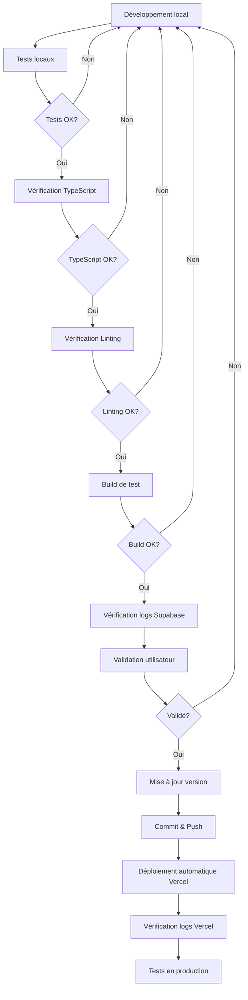

# 🛠️ GUIDE DES DÉVELOPPEURS - INVENTORY MANAGER

## 📋 TABLE DES MATIÈRES

1. [Quick Start](#quick-start)
2. [Documentation complète](#documentation-complète)
3. [Debugging](#debugging)
4. [Processus de développement](#processus-de-développement)
5. [Scripts disponibles](#scripts-disponibles)
6. [Architecture](#architecture)
7. [Tests](#tests)

---

## 🚀 QUICK START

### Installation

```bash
# 1. Cloner le projet
git clone <url-du-repo>
cd inventory-app

# 2. Installer les dépendances
npm install

# 3. Configurer les variables d'environnement
cp .env.example .env.local
# Éditer .env.local avec vos clés Supabase

# 4. Lancer le serveur de développement
npm run dev
```

### Premier test

```bash
# Tester que tout fonctionne
chmod +x test-app.sh
./test-app.sh
```

---

## 📚 DOCUMENTATION COMPLÈTE

### Pour les développeurs

| Document | Description |
|----------|-------------|
| **[DEBUGGING_GUIDE.md](docs/DEBUGGING_GUIDE.md)** | Guide complet de debugging avec monitoring en temps réel |
| **[ARCHITECTURE_GUIDE.md](docs/ARCHITECTURE_GUIDE.md)** | Architecture de l'application, flux de données, composants clés |
| **[DEVELOPMENT_PROCESSES.md](docs/DEVELOPMENT_PROCESSES.md)** | Processus de développement obligatoires (versioning, tests, déploiement) |
| **[APPLICATION_DOCUMENTATION.md](docs/APPLICATION_DOCUMENTATION.md)** | Documentation complète de l'application |

### Pour les utilisateurs

| Document | Description |
|----------|-------------|
| **[README.md](README.md)** | Guide d'installation et d'utilisation |
| **[CHANGELOG.md](CHANGELOG.md)** | Historique des versions |
| **[QUICK_START.md](docs/QUICK_START.md)** | Démarrage rapide |

---

## 🔧 DEBUGGING

### Outils de debugging disponibles

#### 1. Monitoring en temps réel

```bash
# Monitoring complet avec Puppeteer (recommandé)
node monitor-realtime-console.js

# Options :
# - Capture tous les logs console
# - Capture les erreurs page et réseau
# - Enregistre dans des fichiers de log
# - Affiche des statistiques en temps réel
```

#### 2. Test automatique de l'application

```bash
# Tester toute l'application
./test-app.sh

# Résultats :
# ✅ Environnement, dépendances, configuration
# ✅ Code & compilation (TypeScript, linting)
# ✅ Build & serveur
# ✅ Documentation
```

#### 3. Configuration centralisée

```javascript
// debug.config.js
const debugConfig = require('./debug.config.js');

// Activer/désactiver les logs par module
debugConfig.logging.enabledModules = ['ProductService', 'Supabase'];

// Utiliser les helpers
debugConfig.log('success', 'ProductService', 'Produit créé', { id: '123' });
```

### Console Chrome DevTools

```javascript
// Dans la console Chrome :

// 1. Afficher uniquement les logs de ProductService
// Filtre : "ProductService"

// 2. Afficher uniquement les erreurs Supabase
// Filtre : "⚠️ Erreur"

// 3. Afficher tous les logs liés au stock
// Filtre : "stock"
```

### Logs Supabase (via MCP)

```bash
# Logs API (requêtes HTTP)
# Via MCP Supabase : get_logs(service: "api")

# Logs Postgres (requêtes SQL)
# Via MCP Supabase : get_logs(service: "postgres")

# Logs Storage (upload fichiers)
# Via MCP Supabase : get_logs(service: "storage")
```

### Logs Vercel (via MCP)

```bash
# Logs de build
# Via MCP Vercel : get_deployment_build_logs()

# Logs de runtime
# Via MCP Vercel : get_deployment(idOrUrl)
```

---

## 📝 PROCESSUS DE DÉVELOPPEMENT

### Workflow obligatoire



### Checklist complète

**Avant de commencer :**
- [ ] Comprendre la demande utilisateur
- [ ] Planifier les modifications
- [ ] Vérifier l'impact sur l'existant

**Pendant le développement :**
- [ ] Développer localement
- [ ] Tester chaque modification
- [ ] Documenter les changements

**Tests obligatoires :**
- [ ] `npm run type-check` - TypeScript OK
- [ ] `npm run lint` - Pas d'erreurs
- [ ] `npm run build:check` - Build OK
- [ ] Tests navigateur - Console sans erreurs
- [ ] Tests fonctionnels - Tout fonctionne
- [ ] Vérifier logs Supabase via MCP

**Validation utilisateur :**
- [ ] **ATTENDRE LA VALIDATION** de l'utilisateur
- [ ] Corriger si nécessaire
- [ ] **NE PAS DÉPLOYER** sans validation

**Avant le commit :**
- [ ] Mettre à jour la version (`npm run version:patch`)
- [ ] Mettre à jour le CHANGELOG
- [ ] Commit avec message descriptif

**Déploiement via MCP :**
- [ ] Push vers GitHub
- [ ] Attendre 45 secondes
- [ ] Vérifier logs Vercel via MCP
- [ ] Tester en production
- [ ] Confirmer le bon fonctionnement

---

## 📜 SCRIPTS DISPONIBLES

### Développement

```bash
# Serveur de développement
npm run dev

# Serveur avec mode inspect Node.js
npm run dev:debug

# Serveur avec monitoring des logs
npm run dev:monitor

# Redémarrer le serveur (kill + restart)
npm run dev:clean
```

### Build & Tests

```bash
# Build de production
npm run build

# Build avec vérification
npm run build:check

# Vérification TypeScript
npm run type-check

# Linting
npm run lint

# Linting avec correction automatique
npm run lint:fix

# Test du serveur
npm run test:server
```

### Logs

```bash
# Afficher les logs en temps réel
npm run logs

# Afficher uniquement les erreurs
npm run logs:error
```

### Versioning

```bash
# Incrémenter la version patch (V0.0.X)
npm run version:patch

# Incrémenter la version minor (V0.X.0)
npm run version:minor

# Incrémenter la version major (VX.0.0)
npm run version:major

# Afficher la version actuelle
npm run version:show
```

### Monitoring & Debugging

```bash
# Monitoring en temps réel avec Puppeteer
node monitor-realtime-console.js

# Test automatique complet
./test-app.sh

# Vérification rapide
./quick-check.sh

# Monitoring des erreurs JS
./monitor-js-errors.sh

# Monitoring des logs en direct
./monitor-logs.sh
```

---

## 🏗️ ARCHITECTURE

### Stack technique

```
┌─────────────────────────────────────────────┐
│           FRONTEND (Next.js 16)             │
│  ┌──────────────────────────────────────┐  │
│  │  React 19 + TypeScript                │  │
│  │  Tailwind CSS + Shadcn/ui             │  │
│  └──────────────────────────────────────┘  │
└─────────────────────────────────────────────┘
                ↓
┌─────────────────────────────────────────────┐
│         BACKEND (Supabase)                  │
│  ┌──────────────────────────────────────┐  │
│  │  PostgreSQL + Row Level Security      │  │
│  │  Storage (Images)                     │  │
│  │  Realtime (WebSockets)                │  │
│  └──────────────────────────────────────┘  │
└─────────────────────────────────────────────┘
```

### Structure du projet

```
inventory-app/
├── src/
│   ├── app/                  # Pages Next.js (App Router)
│   ├── components/           # Composants React
│   │   ├── inventory/        # Composants gestion stock
│   │   ├── scanner/          # Scanner codes-barres
│   │   ├── layout/           # Composants layout
│   │   └── ui/               # Composants UI (Shadcn)
│   └── lib/                  # Services et utilitaires
│       ├── services.ts       # ProductService, CategoryService
│       ├── stockService.ts   # Service gestion stock
│       ├── supabase.ts       # Client Supabase + Types
│       └── utils.ts          # Utilitaires
├── docs/                     # Documentation complète
├── scripts/                  # Scripts utilitaires
├── logs/                     # Fichiers de log (généré)
├── debug.config.js           # Configuration debugging
├── test-app.sh              # Script de test automatique
├── monitor-realtime-console.js  # Monitoring temps réel
└── README_DEVELOPERS.md      # Ce fichier
```

### Composants clés

| Composant | Responsabilité |
|-----------|---------------|
| **page.tsx** | Page principale (liste produits) |
| **ProductInspector** | Inspecteur/éditeur de produit |
| **CompactProductList** | Liste compacte avec tri/filtres |
| **ProductForm** | Formulaire ajout/édition |
| **BarcodeScanner** | Scanner codes-barres |
| **StockTab** | Gestion des opérations de stock |

### Services

| Service | Méthodes principales |
|---------|---------------------|
| **ProductService** | `getAll()`, `create()`, `update()`, `delete()`, `updateQuantity()` |
| **CategoryService** | `getAll()`, `create()` |
| **StockService** | `performStockOperation()`, `getOperationHistory()` |

---

## ✅ TESTS

### Tests manuels

1. **Chargement des produits**
   - ✓ Liste affichée correctement
   - ✓ Images chargées
   - ✓ Statuts de stock corrects

2. **Recherche**
   - ✓ Recherche par nom
   - ✓ Recherche par code-barres
   - ✓ Recherche par référence

3. **Ajout de produit**
   - ✓ Formulaire s'ouvre
   - ✓ Validation des champs
   - ✓ Enregistrement réussi
   - ✓ Apparaît dans la liste

4. **Modification de produit**
   - ✓ Inspecteur s'ouvre
   - ✓ Données chargées
   - ✓ Modifications sauvegardées
   - ✓ Liste mise à jour

5. **Gestion du stock**
   - ✓ Incrémentation/décrémentation
   - ✓ Historique enregistré
   - ✓ Interface réactive

6. **Scanner code-barres**
   - ✓ Caméra s'ouvre
   - ✓ Détection du code
   - ✓ Fermeture du scanner
   - ✓ Données pré-remplies

### Tests automatiques

```bash
# Exécuter tous les tests
./test-app.sh

# Tests TypeScript
npm run type-check

# Tests de linting
npm run lint

# Tests de build
npm run build:check
```

### Tests de performance

```bash
# Monitoring en temps réel
node monitor-realtime-console.js

# Vérifier les métriques :
# - JSHeapUsedSize < 100 MB
# - Temps de rendu < 100ms
# - Temps réponse API < 2s
```

---

## 🚨 ERREURS COURANTES

### 1. Erreur de connexion Supabase

**Symptômes :**
```
⚠️ Erreur lors du chargement des produits
```

**Solutions :**
1. Vérifier `.env.local`
2. Vérifier les clés Supabase
3. Tester la connexion :
```javascript
const { data, error } = await supabase.from('products').select('count');
```

### 2. Erreur TypeScript

**Symptômes :**
```
error TS2339: Property 'X' does not exist on type 'Y'
```

**Solutions :**
1. Vérifier les types dans `lib/supabase.ts`
2. Ajouter les propriétés manquantes
3. Utiliser `as any` temporairement si nécessaire

### 3. Erreur de build

**Symptômes :**
```
Error: Failed to compile
```

**Solutions :**
1. `npm run type-check` pour voir les erreurs
2. `npm run lint` pour voir les warnings
3. Corriger les erreurs une par une

### 4. Erreur de caméra

**Symptômes :**
```
NotAllowedError: Permission denied
```

**Solutions :**
1. Utiliser HTTPS (ou localhost)
2. Autoriser la caméra dans le navigateur
3. Vérifier les permissions système

---

## 📞 SUPPORT

### En cas de problème

1. **Vérifier les logs** (navigateur, Supabase, Vercel)
2. **Consulter le [DEBUGGING_GUIDE.md](docs/DEBUGGING_GUIDE.md)**
3. **Consulter le [ARCHITECTURE_GUIDE.md](docs/ARCHITECTURE_GUIDE.md)**
4. **Tester en local** pour reproduire
5. **Utiliser les outils MCP** appropriés

### Informations à fournir

- Version actuelle de l'application
- Logs d'erreur complets
- Étapes de reproduction
- Environnement (local/production)
- Résultats des tests MCP

---

## 🎯 BONNES PRATIQUES

### Code

- ✅ **TypeScript strict** : Types explicites partout
- ✅ **Composants fonctionnels** : Hooks plutôt que classes
- ✅ **Logs structurés** : Emojis + contexte
- ✅ **Commentaires en français** : Pour la logique métier
- ✅ **Naming conventions** : camelCase variables, PascalCase composants

### Debugging

- ✅ **Logs détaillés** : Début, succès, erreurs avec données
- ✅ **Try-catch** : Toujours gérer les erreurs
- ✅ **Console Chrome** : Utiliser les filtres
- ✅ **React DevTools** : Inspecter l'état des composants
- ✅ **Network panel** : Vérifier les requêtes Supabase

### Performance

- ✅ **useMemo** : Mémoriser les calculs coûteux
- ✅ **useCallback** : Mémoriser les fonctions
- ✅ **Lazy loading** : Charger les composants lourds à la demande
- ✅ **Debounce** : Pour les recherches et inputs fréquents

### Sécurité

- ✅ **RLS Supabase** : Toujours activer
- ✅ **Variables d'environnement** : Ne jamais commit `.env.local`
- ✅ **Validation serveur** : Ne jamais faire confiance au client
- ✅ **Sanitization** : Nettoyer les entrées utilisateur

---

## 📄 LICENCE

MIT

---

**📝 Ce guide doit être consulté avant de commencer tout développement.**

**Pour plus d'informations, consultez la [documentation complète](docs/).**

